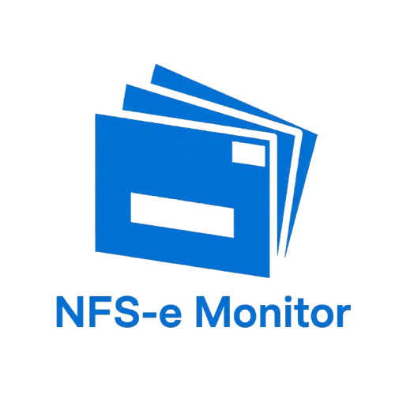

<p align="center">
  
</p>

<h1 align="center">NFS-e Monitor</h1>

<p align="center">
  <strong>Gestão inteligente de Notas Fiscais de Serviço para Escritórios de Contabilidade</strong>
</p>

<p align="center">
  <a href="https://github.com/matheuscardosos/Nfs-e-Monitor/releases">
    
  </a>
  <a href="#">
    
  </a>
  <a href="https://github.com/matheuscardosos/Nfs-e-Monitor/blob/main/LICENSE">
    
  </a>
  <a href="https://github.com/matheuscardosos/Nfs-e-Monitor/releases">
    
  </a>
</p>

---

> **Aviso (03/06/2026):** O portal NFS-e Nacional implementou hCaptcha nos endpoints de download de XML e DANFSe. O problema foi corrigido na **v1.5.4** com a identificação de uma rota alternativa que não exige validação humana. Os downloads voltam a funcionar normalmente. Existe risco de que o portal passe a exigir token real nessa rota em versões futuras — se isso acontecer, os downloads voltarão a falhar e uma nova correção será necessária. O acompanhamento está na issue [#1](https://github.com/matheuscardosos/Nfs-e-Monitor/issues/1).

---

## Índice

- [Sobre o projeto](#sobre-o-projeto)
- [Para usuários finais](#para-usuários-finais)
- [Para contribuidores](#para-contribuidores)
  - [Pré-requisitos](#pré-requisitos)
  - [Rodar localmente](#rodar-localmente)
  - [Estrutura do projeto](#estrutura-do-projeto)
  - [Commitar mudanças](#commitar-mudanças)
  - [Gerar banners do instalador](#gerar-banners-do-instalador)
  - [Criar uma tag de release](#criar-uma-tag-de-release)
- [Licença](#licença)

---

## Sobre o projeto

O **NFS-e Monitor** é uma aplicação desktop para Windows que centraliza a gestão de Notas Fiscais de Serviço Eletrônicas (NFS-e) do portal NFS-e Nacional. Desenvolvida para escritórios de contabilidade que precisam gerenciar múltiplos clientes sem acessar o portal individualmente para cada um.

---

## Para usuários finais

Acesse a [página de releases](https://github.com/matheuscardosos/Nfs-e-Monitor/releases) e baixe o instalador `NFS-e-Monitor-Setup-X.X.X.exe`. Execute e siga o assistente. O programa se atualiza automaticamente quando novas versões são publicadas.

---

## Para contribuidores

### Pré-requisitos

- [Node.js](https://nodejs.org/) v18 ou superior
- npm (incluído com o Node.js)
- Git
- Windows (o projeto só compila para Windows)

### Rodar localmente

```bash
# 1. Clonar o repositório
git clone https://github.com/matheuscardosos/Nfs-e-Monitor.git
cd Nfs-e-Monitor

# 2. Instalar dependências
npm install

# 3. Iniciar em modo desenvolvimento
npm start
```

> O banco de dados SQLite é criado automaticamente em `%APPDATA%\NFS-e Monitor\nfse-manager.db` na primeira execução.

### Estrutura do projeto

```
nfse-manager/
├── main.js                  # Processo principal Electron (janelas, tray, auto-update)
├── preload.js               # Ponte segura entre main e renderer (contextBridge)
├── index.html               # Interface principal do app
├── renderer/
│   ├── app.js               # Lógica do renderer (toda interação com a UI)
│   └── styles.css           # Estilos da interface
├── services/
│   ├── database.js          # Inicialização e acesso ao banco SQLite (sql.js)
│   ├── ipc-handlers.js      # Todos os handlers IPC do processo principal
│   ├── nfse-api.js          # Integração com a API do portal NFS-e Nacional
│   ├── certificate.js       # Leitura e parsing de certificados A1 (PFX)
│   ├── portal-status.js     # Verificação de status do portal
│   └── pdf-report.js        # Geração de relatórios PDF
├── scripts/
│   └── generate-banners.js  # Gera os banners BMP usados no instalador NSIS
├── assets/                  # Ícones SVG usados na interface
└── build/                   # Recursos do instalador (ícone, banners BMP)
```

### Commitar mudanças

Use mensagens de commit em português, no imperativo, sem ponto final:

```bash
git add <arquivos>
git commit -m "Corrige download de XML quando hCaptcha ativo"
git push origin main
```

Convenções de prefixo (recomendadas, não obrigatórias):

| Prefixo | Quando usar |
|---------|-------------|
| `Corrige` | Bug fix |
| `Adiciona` | Nova funcionalidade |
| `Atualiza` | Melhoria em algo existente |
| `Remove` | Remoção de código ou recurso |
| `Refatora` | Mudança interna sem impacto no comportamento |

### Gerar banners do instalador

Os banners BMP do instalador NSIS (`installerHeader.bmp`, `installerSidebar.bmp`, etc.) são gerados automaticamente a partir do ícone do projeto e da versão atual do `package.json`.

Execute **antes de buildar**:

```bash
npm run generate-banners
# ou diretamente:
node scripts/generate-banners.js
```

Os arquivos são gravados em `build/`. Não edite os BMPs manualmente — eles serão sobrescritos na próxima geração.

### Criar uma tag de release

1. Atualize a versão em `package.json`:
   ```bash
   # Edite o campo "version" em package.json, ex: "1.5.5"
   ```

2. Gere os banners com a nova versão:
   ```bash
   node scripts/generate-banners.js
   ```

3. Commit e tag:
   ```bash
   git add package.json build/
   git commit -m "Versao 1.5.5"
   git tag v1.5.5
   git push origin main --tags
   ```

4. O GitHub Actions (se configurado) faz o build e publica o release automaticamente. Caso contrário, buildar manualmente:
   ```bash
   npm run build
   # Instalador gerado em dist/NFS-e-Monitor-Setup-X.X.X.exe
   ```

---

## Licença

**AGPL-3.0** © 2026 Matheus Cardoso Soares

Este software é distribuído sob a [GNU Affero General Public License v3.0](LICENSE). Qualquer redistribuição ou versão modificada deve ser disponibilizada sob a mesma licença com o código-fonte completo.

Consulte também: [Termos de Uso](https://www.nfsemonitor.com.br/termos-de-uso) · [Privacidade](https://www.nfsemonitor.com.br/privacidade) · [Licenças de código aberto](https://www.nfsemonitor.com.br/licencas)

---

<p align="center">
  <sub>Mantido por <a href="https://github.com/matheuscardosos">Matheus Cardoso Soares</a></sub>
</p>
